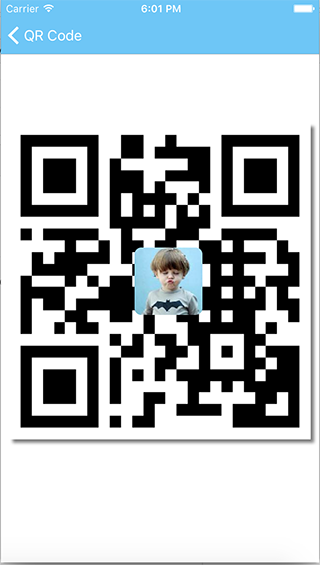
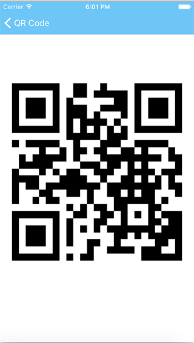

# ZRQRCodeViewController
A delightful QR Code Scanning framework that is compatible with iOS 7.0 and later. It has strongly precision to scan QR Code. It can scan QR Code and Bar Code.

[](https://github.com/VictorZhang2014/ZRQRCodeViewController)
[](http://cocoapods.org/pods/ZRQRCodeViewController)
[](http://cocoapods.org/pods/ZRQRCodeViewController)
[](http://cocoapods.org/pods/ZRQRCodeViewController)
[](http://cocoapods.org/pods/ZRQRCodeViewController)

### Effect Photo




### 滚动到最下面有中文说明
### CSDN博文
- [CSDN博文详解 ZRQRCodeViewController](http://blog.csdn.net/u013538542/article/details/51883644) 

### What's new?
> 1.Scanning QR Code
> 2.Scanning Bar Code
> 3.Recognizing from Photo Library
> 4.Recognizing by long press QR Code picture
> 5.Recognizing through a UIImage
> 6.Generating QR Code with or without logo
> 7.Customizing sound name when scanning succeeded

## How to get started
-----------------------------------

- [Download ZRQRCodeViewController](https://github.com/VictorZhang2014/ZRQRCodeViewController) try out the example app


## Installation
-----------------------------------

### CocoaPods

[CocoaPods](http://cocoapods.org) is a dependency manager for Objective-C , which anutomates and simplifies the process of using 3rd-party libraries like ZRQRCodeViewController in you projects.

```bash
$ gem install cocoapods
```

> Cocoapods 1.0.0+ is required to build ZRQRCodeViewController 3.1.5

#### podfile

To integrate ZRQRCodeViewController into your Xcode project using Cocoapods, specify it in your `Podfile`:

```ruby
source 'https://github.com/VictorZhang2014/ZRQRCodeViewController'
platform :ios, '7.0'  

pod 'ZRQRCodeViewController', '~>3.1.5'
```
Then, run the following command:

```bash
$ pod install
```

### Carthage

[Carthage](https://github.com/Carthage/Carthage) is a decentralized dependency manager that builds your dependencies and provides you with binary frameworks.

You can install Carthage with [Homebrew](http://brew.sh/) using the following command:

```bash
$ brew update
$ brew install carthage
```

To integrate ZRQRCodeViewController into your Xcode project using Carthage, specify it in your `Cartfile`:

```carthage
github "VictorZhang2014/ZRQRCodeViewController" 
```

Run `carthage update` to build the framework and drag the built `ZRQRCodeViewController.framework` into your Xcode project.


## Usage
----------------------------------

#### QR Code scan by camera, once a result ,after that, will close the current controller
```objective-c
ZRQRCodeViewController *qrCode = [[ZRQRCodeViewController alloc] initWithScanType:ZRQRCodeScanTypeReturn];
qrCode.qrCodeNavigationTitle = @"QR Code Scanning";
qrCode.errorMessage = @"Access Denied";
[qrCode QRCodeScanningWithViewController:self completion:^(NSString *strValue) {
    NSLog(@"strValue = %@ ", strValue);
    if([[UIApplication sharedApplication] canOpenURL:[NSURL URLWithString:strValue]]){
        [[UIApplication sharedApplication] openURL:[NSURL URLWithString:strValue]];
    } else {
        UIAlertView *alertView = [[UIAlertView alloc] initWithTitle:@"Ooooops!" message:[NSString stringWithFormat:@"The result is %@", strValue] delegate:nil cancelButtonTitle:@"Cancel" otherButtonTitles:nil, nil];
        [alertView show];
    }
} failure:^(NSString *message) {
    
    NSLog(@"Error Message = %@", message);
}];
```

#### QR Code scan by camera, once a result, after that , won't close the current controller
```objective-c
ZRQRCodeViewController *qrCode = [[ZRQRCodeViewController alloc] initWithScanType:ZRQRCodeScanTypeContinuation];
[qrCode QRCodeScanningWithViewController:self completion:^(NSString *strValue) {
    NSLog(@"strValue = %@ ", strValue);
    if([[UIApplication sharedApplication] canOpenURL:[NSURL URLWithString:strValue]]){
        [[UIApplication sharedApplication] openURL:[NSURL URLWithString:strValue]];
    } else {
        UIAlertView *alertView = [[UIAlertView alloc] initWithTitle:@"Ooooops!" message:[NSString stringWithFormat:@"The result is %@", strValue] delegate:nil cancelButtonTitle:@"Cancel" otherButtonTitles:nil, nil];
        [alertView show];
    }
} failure:^(NSString *message) {
    
    NSLog(@"Error Message = %@", message);
}];
```

#### QR Code scan by camera , once a result , after that, will close the current controller. Its view can custom
```objective-c
    //ZRQRCodeScanView and ZRQRCodeScanView2 are customized view which I did, you can drag them to your project so that you don't have to create a view for yourself.

    [[[ZRQRCodeScanView2 alloc] init] openQRCodeScan:self];

    [[[ZRQRCodeScanView alloc] init] openQRCodeScan:self];
```

#### QR Code scan from the Photo Library 
```objective-c
ZRQRCodeViewController *qrCode = [[ZRQRCodeViewController alloc] initWithScanType:ZRQRCodeScanTypeReturn];
qrCode.textWhenNotRecognized = @"No any QR Code texture on the picture were found!";
[qrCode recognizationByPhotoLibraryViewController:self completion:^(NSString *strValue) {
    NSLog(@"strValue = %@ ", strValue);
    UIAlertView *alert = [[UIAlertView alloc] initWithTitle:@"Note" message:[NSString stringWithFormat:@"Result: %@", strValue] delegate:nil cancelButtonTitle:nil otherButtonTitles:@"OK", nil];
    [alert show];

} failure:^(NSString *message) {
    
    NSLog(@"Error Message = %@", message);
}];
```

#### QR Code scan by long-press that object, which is one of them ,UIImageView, UIButton, UIWebView, WKWebView, UIView, UIViewController 

#### Note: Bind long-press gesture first, then using.
           Like this variable `self.imageViewExample` that 
           it needs the event of long-press. You can bind the gesture in the method `viewDidLoad()`.

```objective-c
ZRQRCodeViewController *qrCode = [[ZRQRCodeViewController alloc] initWithScanType:ZRQRCodeScanTypeReturn];
qrCode.cancelButton = @"Cancel";
qrCode.actionSheets = @[];
qrCode.extractQRCodeText = @"Extract QR Code";
NSString *savedImageText = @"Save Image";
qrCode.saveImaegText = savedImageText;
[qrCode extractQRCodeByLongPressViewController:self Object:self.imageViewExample actionSheetCompletion:^(int index, NSString * _Nonnull value) {
    if ([value isEqualToString:savedImageText]) {
       [[ZRAlertController defaultAlert] alertShow:self title:@"" message:@"Saved Image Successfully!" okayButton:@"Ok" completion:^{ }];
    }
} completion:^(NSString * _Nonnull strValue) {
    NSLog(@"strValue = %@ ", strValue);
    [[ZRAlertController defaultAlert] alertShow:self title:@"" message:[NSString stringWithFormat:@"Result: %@", strValue] okayButton:@"Ok" completion:^{
        if([[UIApplication sharedApplication] canOpenURL:[NSURL URLWithString:strValue]]){
            [[UIApplication sharedApplication] openURL:[NSURL URLWithString:strValue]];
        } else {
            UIAlertView *alertView = [[UIAlertView alloc] initWithTitle:@"Ooooops!" message:[NSString stringWithFormat:@"The result is %@", strValue] delegate:nil cancelButtonTitle:@"Cancel" otherButtonTitles:nil, nil];
            [alertView show];
        }
    }];
}];
```


### Generate QR Code as a picture
```
//Indicate UIImageView rect
CGRect rect = CGRectMake(10, 10, [UIScreen mainScreen].bounds.size.width - 20, [UIScreen mainScreen].bounds.size.width - 20);

//And then returns a UIImageView which is QRCode picture with rect through indicating data string
UIImageView *myImage = [[[ZRQRCodeViewController alloc] init] generateQuickResponseCodeWithFrame:rect dataString:@"https://www.baidu.com"];
```

### Generate QR Code as a picture amidst a center icon 
```
//Indicate UIImageView rect
CGRect rect = CGRectMake(10, 10, [UIScreen mainScreen].bounds.size.width - 20, [UIScreen mainScreen].bounds.size.width - 20);

//And then returns a UIImageView which is QRCode picture with rect through indicating data string and amidst a icon
UIImage *center = [UIImage imageNamed:@"centericon"];
UIImageView *myImage = [[[ZRQRCodeViewController alloc] init] generateQuickResponseCodeWithFrame:rect dataString:@"https://www.baidu.com" centerImage:center];
```

### Generate QR Code as a picture amidst a center icon and has shadow effect
```
//Indicate UIImageView rect
CGRect rect = CGRectMake(10, 10, [UIScreen mainScreen].bounds.size.width - 20, [UIScreen mainScreen].bounds.size.width - 20);

//And then returns a UIImageView which is QRCode picture with rect through indicating data string and amidst a icon and shadow effect
UIImage *center = [UIImage imageNamed:@"centericon"];
UIImageView *myImage = [[[ZRQRCodeViewController alloc] init] generateQuickResponseCodeWithFrame:rect dataString:@"https://www.baidu.com" centerImage:center needShadow:YES];
```


# ZRQRCodeViewController
ZRQRCodeViewController是一个非常好用的二维码扫描框架，兼容iOS 7.0及以后的系统版本。    有很精确的扫描能力，识别二维码和条形码。

### CSDN博文
- [CSDN博文详解 ZRQRCodeViewController](http://blog.csdn.net/u013538542/article/details/51883644) 

## 如何开始
-----------------------------------

- [下载ZRQRCodeViewController](https://github.com/VictorZhang2014/ZRQRCodeViewController) 试一试Demo，很简单


## 安装
-----------------------------------

[CocoaPods](http://cocoapods.org) Cocoapods是一个Objective-C的库文件依赖管理器，它会自动的，简单化的集成第三方库到你的项目，例如ZRQRCodeViewController。

```bash
$ gem install cocoapods
```

> Cocoapods 1.0.0+ is required to build ZRQRCodeViewController 3.1.5

#### podfile

使用Cocoapods把ZRQRCodeViewController库集成到你的项目，podfile文件内容如下

```ruby
source 'https://github.com/VictorZhang2014/ZRQRCodeViewController'
platform :ios, '7.0'  

pod 'ZRQRCodeViewController', '~>3.1.5'
```
接着，运行以下命令

```bash
$ pod install
```

## 使用方法
----------------------------------

#### 通过摄像头扫描二维码，扫描一次返回一个结果，并结束当前扫描控制器
```objective-c
ZRQRCodeViewController *qrCode = [[ZRQRCodeViewController alloc] initWithScanType:ZRQRCodeScanTypeReturn];
qrCode.qrCodeNavigationTitle = @"QR Code Scanning";
qrCode.errorMessage = @"Access Denied";
[qrCode QRCodeScanningWithViewController:self completion:^(NSString *strValue) {
    NSLog(@"strValue = %@ ", strValue);
    if([[UIApplication sharedApplication] canOpenURL:[NSURL URLWithString:strValue]]){
        [[UIApplication sharedApplication] openURL:[NSURL URLWithString:strValue]];
    } else {
        UIAlertView *alertView = [[UIAlertView alloc] initWithTitle:@"Ooooops!" message:[NSString stringWithFormat:@"The result is %@", strValue] delegate:nil cancelButtonTitle:@"Cancel" otherButtonTitles:nil, nil];
        [alertView show];
    }
} failure:^(NSString *message) {
    
    NSLog(@"Error Message = %@", message);
}];
```

#### 通过摄像头扫描二维码，扫描一次返回一个结果，不结束当前扫描控制器
```objective-c
ZRQRCodeViewController *qrCode = [[ZRQRCodeViewController alloc] initWithScanType:ZRQRCodeScanTypeContinuation];
[qrCode QRCodeScanningWithViewController:self completion:^(NSString *strValue) {
    NSLog(@"strValue = %@ ", strValue);
    if([[UIApplication sharedApplication] canOpenURL:[NSURL URLWithString:strValue]]){
        [[UIApplication sharedApplication] openURL:[NSURL URLWithString:strValue]];
    } else {
        UIAlertView *alertView = [[UIAlertView alloc] initWithTitle:@"Ooooops!" message:[NSString stringWithFormat:@"The result is %@", strValue] delegate:nil cancelButtonTitle:@"Cancel" otherButtonTitles:nil, nil];
        [alertView show];
    }
} failure:^(NSString *message) {
    
    NSLog(@"Error Message = %@", message);
}];
```

#### 通过摄像头扫描，扫描一次返回一个结果，会结束挡墙控制器，并且它的view可以自定义
```objective-c
    //ZRQRCodeScanView and ZRQRCodeScanView2 都是自定义的UIView的扫描界面，如果你觉得这解决做的还好，不可以拖拽他们到你的项目

    [[[ZRQRCodeScanView2 alloc] init] openQRCodeScan:self];

    [[[ZRQRCodeScanView alloc] init] openQRCodeScan:self];
```

####  从手机相册中选择一张图片进行扫描，
```objective-c
ZRQRCodeViewController *qrCode = [[ZRQRCodeViewController alloc] initWithScanType:ZRQRCodeScanTypeReturn];
qrCode.textWhenNotRecognized = @"No any QR Code texture on the picture were found!";
[qrCode recognizationByPhotoLibraryViewController:self completion:^(NSString *strValue) {
    NSLog(@"strValue = %@ ", strValue);
    UIAlertView *alert = [[UIAlertView alloc] initWithTitle:@"Note" message:[NSString stringWithFormat:@"Result: %@", strValue] delegate:nil cancelButtonTitle:nil otherButtonTitles:@"OK", nil];
    [alert show];

} failure:^(NSString *message) {
    
    NSLog(@"Error Message = %@", message);
}];
```

#### 通过长按要被扫描的对象，它可以是这些UIImageView, UIButton, UIWebView, WKWebView, UIView, UIViewController 

#### 注意: 先绑定长按手势，再使用。
例如这个变量，`self.imageViewExample` 它需要长按事件。可以在 `viewDidLoad()`方法中绑定该手势

```objective-c
    ZRQRCodeViewController *qrCode = [[ZRQRCodeViewController alloc] initWithScanType:ZRQRCodeScanTypeReturn];
    qrCode.cancelButton = @"Cancel";
    qrCode.actionSheets = @[];
    qrCode.extractQRCodeText = @"Extract QR Code";
    NSString *savedImageText = @"Save Image";
    qrCode.saveImaegText = savedImageText;
    [qrCode extractQRCodeByLongPressViewController:self Object:self.myImgView actionSheetCompletion:^(int index, NSString * _Nonnull value) {
        if ([value isEqualToString:savedImageText]) {
            UIAlertView *alert = [[UIAlertView alloc] initWithTitle:@"Result" message:@"Saved Image Successfully!" delegate:nil cancelButtonTitle:nil otherButtonTitles:@"OK", nil];
            [alert show];
        }
    } completion:^(NSString * _Nonnull strValue) {
        NSLog(@"strValue = %@ ", strValue);
        UIAlertView *alert = [[UIAlertView alloc] initWithTitle:@"Result" message:[NSString stringWithFormat:@"Result: %@", strValue] delegate:nil cancelButtonTitle:nil otherButtonTitles:@"OK", nil];
        [alert show];
        
    } failure:^(NSString *message) {
        UIAlertView *alert = [[UIAlertView alloc] initWithTitle:@"Note" message:message delegate:nil cancelButtonTitle:nil otherButtonTitles:@"OK", nil];
        [alert show];
        NSLog(@"Error Message = %@", message);
    }];
```

### 生成二维码
```
//指定UIImageView 的 rect 大小
CGRect rect = CGRectMake(10, 10, [UIScreen mainScreen].bounds.size.width - 20, [UIScreen mainScreen].bounds.size.width - 20);

//然后，返回一个QRCode图片，通过指定大小的rect和数据字符串
UIImageView *myImage = [[[ZRQRCodeViewController alloc] init] generateQuickResponseCodeWithFrame:rect dataString:@"https://github.com/VictorZhang2014"];
```

### 生成二维码 带 中间icon
```
//指定UIImageView 的 rect 大小
CGRect rect = CGRectMake(10, 10, [UIScreen mainScreen].bounds.size.width - 20, [UIScreen mainScreen].bounds.size.width - 20);

//然后，返回一个QRCode图片，通过指定大小的rect和数据字符串，中间带一个icon
UIImage *center = [UIImage imageNamed:@"centericon"];
UIImageView *myImage = [[[ZRQRCodeViewController alloc] init] generateQuickResponseCodeWithFrame:rect dataString:@"https://github.com/VictorZhang2014" centerImage:center];
```

### 生成二维码 带 中间icon ,并且带有阴影效果
```
//指定UIImageView 的 rect 大小
CGRect rect = CGRectMake(10, 10, [UIScreen mainScreen].bounds.size.width - 20, [UIScreen mainScreen].bounds.size.width - 20);

//然后，返回一个QRCode图片，通过指定大小的rect和数据字符串，中间带一个icon, 并且有阴影效果
UIImage *center = [UIImage imageNamed:@"centericon"];
UIImageView *myImage = [[[ZRQRCodeViewController alloc] init] generateQuickResponseCodeWithFrame:rect dataString:@"https://github.com/VictorZhang2014" centerImage:center needShadow:YES];
```
